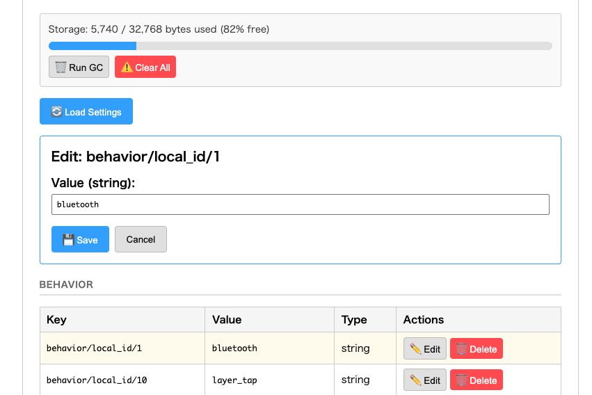

# ZMK Feature: Zephyr Setting Expose


[](https://github.com/cormoran/zmk-feature-zephyr-setting-expose/actions/workflows/zmk-module.yml) [](https://github.com/cormoran/zmk-feature-zephyr-setting-expose/actions/workflows/devcontainer.yml)

This ZMK module exposes the Zephyr settings store (NVS key/value pairs) to a connected browser via the **unofficial** custom ZMK Studio RPC protocol. It lets you inspect, edit, or delete any persisted setting on your keyboard without reflashing firmware.



## Summary

- **Firmware**: Custom Studio RPC handler (`src/studio/setting_expose_handler.c`)
- **Protocol**: Protobuf definition (`proto/zmk/setting_expose/setting_expose.proto`)
- **Web UI**: React + TypeScript app (`web/`) at `https://cormoran.github.io/zmk-feature-zephyr-setting-expose/`
- **Tests**: Firmware unit tests (`tests/studio/`, `tests/setting_expose/`) and build tests (`tests/zmk-config/`)

### Supported operations

| Operation    | Description                                            |
| ------------ | ------------------------------------------------------ |
| List         | Enumerate all persisted settings with typed values     |
| Read         | Read a single setting by key                           |
| Write        | Write (persist) a setting value                        |
| Delete       | Delete (reset) a setting by key                        |
| Storage Info | Query NVS storage capacity (total / used / free bytes) |
| GC           | Trigger NVS garbage collection / sector compaction     |
| Clear All    | Delete every persisted setting on the device           |

### Type system

Settings are displayed and edited with type-aware UIs. Firmware code annotates keys with a type via the `ZMK_SETTING_EXPOSE_REGISTER` macro (see [include/zmk/setting_expose.h](include/zmk/setting_expose.h)):

| Type              | Encoding             | Web UI         |
| ----------------- | -------------------- | -------------- |
| `BYTES` (default) | raw bytes            | hex string     |
| `INT32`           | 4-byte little-endian | number input   |
| `BOOL`            | 1 byte               | `true`/`false` |
| `STRING`          | UTF-8                | text input     |

Well-known ZMK settings (BLE profile, output transport, physical layout, behavior local IDs) are pre-registered in `src/zmk_known_settings.c`.

## Module User Guide

### 1. Add dependency to your `config/west.yml`

> **Note**: This module requires a patched ZMK with custom Studio RPC support.

```yml
manifest:
    remotes:
        ...
        - name: cormoran
          url-base: https://github.com/cormoran
    projects:
        ...
        - name: zmk-feature-zephyr-setting-expose
          remote: cormoran
          revision: main
        # Required: patched ZMK with custom Studio RPC support
        - name: zmk
          remote: cormoran
          revision: main+custom-studio-protocol
          import:
              file: app/west.yml
```

### 2. Enable the module in your `config/<shield>.conf`

```conf
CONFIG_ZMK_STUDIO=y
CONFIG_ZMK_SETTING_EXPOSE=y

# Increase RPC buffers to fit setting payloads
CONFIG_ZMK_STUDIO_RPC_RX_BUF_SIZE=128
CONFIG_ZMK_STUDIO_RPC_CUSTOM_SUBSYSTEM_REQUEST_PAYLOAD_MAX_BYTES=140
```

### 3. (Optional) Register type hints for your own settings

```c
#include <zmk/setting_expose.h>

// Exact key: display as an integer
ZMK_SETTING_EXPOSE_REGISTER(my_volume, "mymod/volume", ZMK_SETTING_TYPE_INT32);

// Prefix: all keys starting with "mymod/name/" displayed as strings
ZMK_SETTING_EXPOSE_REGISTER_PREFIX(my_names, "mymod/name/", ZMK_SETTING_TYPE_STRING);
```

### 4. Open the Web UI

Navigate to [https://cormoran.github.io/zmk-feature-zephyr-setting-expose/](https://cormoran.github.io/zmk-feature-zephyr-setting-expose/), connect your keyboard via serial, and unlock the device in ZMK Studio. Then click **Load Settings** to browse and edit your keyboard's settings.

### Web UI

See [web/README.md](./web/README.md) for web UI development instructions.

### Publishing Web UI

**GitHub Pages**: Visit `Actions > Test and Build Web UI > Run workflow` to deploy.

**Cloudflare Workers (PR previews)**: Configure `CLOUDFLARE_API_TOKEN` and `CLOUDFLARE_ACCOUNT_ID` secrets.

## Module Development Guide

### Setup for running tests

#### Option 0: Dev container (recommended)

Open this repository in VS Code with the [Dev Containers extension](https://marketplace.visualstudio.com/items?itemName=ms-vscode-remote.remote-containers). The container automatically initializes the west workspace.

#### Option 1: Shared west workspace layout

```bash
mkdir west-workspace && cd west-workspace
git clone <this repository>
west init -l . --mf west/west-test-workspace.yml
west update --narrow
west zephyr-export
```

#### Option 2: Isolated layout

```bash
git clone <this repository> && cd <cloned directory>
west init -l west --mf west-test-isolated.yml
west update --narrow
west zephyr-export
```

### Pre-commit

```bash
pip install pre-commit
pre-commit install

# Run manually
pre-commit run --all-files
```

### Running Tests

```bash
# Run unit test + build test and verify the results
python3 -m unittest
# Run build test directly
west zmk-build tests/zmk-config
# Run unit test directly
west zmk-test tests -m .
# Run web tests
cd web && npm test
```

### Sync changes from template

Run `Actions > Sync Changes in Template > Run workflow` to get the latest template changes as a pull request.

### Coding agent on Actions

- Mention `@copilot`
- Setup `ANTHROPIC_API_KEY` secret and mention `@claude`
